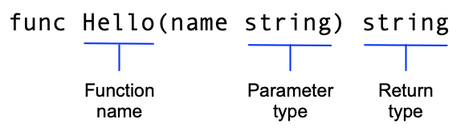

#Tutorial Go
En este tutorial se verá lo básico del lenguaje Go, pasando por módulos, funciones y errores para finalizar viendo cómo realizar pruebas en el código.

Para empezar, si no tenemos instalado el lenguaje, se puede hacer de forma simple siguiendo las instrucciones de la [página oficial](https://golang.org/doc/install).

##Print 'Hello, World!'
Vamos a crear un directorio llamado hello, dentro del cual crearemos el archivo hello.go
En este archivo escribiremos el siguiente código:

    package main

    import "fmt"

    func main() {
    fmt.Println("Hello, World!")
    }

En este pequeño bloque de código estamos creando un paquete main, importamos "fmt", que es una de las librerías standard de go e implementamos una función main con un print.
Para correr este código ecribimos en la consola

  $ go run hello.go

##Llamar código de un paquete externo
En [pkg.go.dev](pkg.go.dev) podemos encontrar múltiples paquetes publicados, en la sección Index dentro de la pestaña Doc, podemos ver las funciones que contiene el paquete en cuestión para saber si alguna nos sirve.
En esta ocasión usaremos la función Go() del paquete 'rcs.io/quote'. El código debería quedar de la siguiente forma:

    package main

    import "fmt"

    import "rsc.io/quote"

    func main() {
      fmt.Println(quote.Go())
    }

Ahora debemos poner nuestro código en un módulo para rastrear las dependencias. Cuando nuestro código importa paquetes desde otro módulo, un archivo go.mod lista los módulos específicos y versiones que proveen esos paquetes.
Para crear un archivo go.mod debemos ejecutar el comando go mod init dandole el nombre del módulo en el que estará nuestro código:

    $ go mod init hello

Ahora corremos nuestro código para ver el mensaje generado por la función Go():

    $ go run hello.go

##Cómo crear un módulo que otros puedan usaremos
En primer lugar, creemos un directorio greetings para este ejemplo e iniciaremos nuestro módulo usando el comando go mod init que vimos anteriormente. En este ejemplo usamos la URL example.com/greetings, esta es la URL desde donde el módulo puede ser descargado.

    $go mod init example.com/greetings

Esto crea el archivo go.mod que identifica a nuestro código como un módulo que puede ser usado desde otro código.

Ahora creamos un archivo llamado greetings.go y pegamos el siguiente código:

    package greetings

    import "fmt"

    // Hello returns a greeting for the named person.
    func Hello(name string) string {
    // Return a greeting that embeds the name in a message.
    message := fmt.Sprintf("Hi, %v. Welcome!", name)
    return message
    }

Este será el primer código para nuestro módulo y retorna un saludo a quien lo pida.

En el bloque anterior se implementó la función Hello, en la que podemos apreciar la siguiente estructura

En Go el operador := es un shortcut para declarar e inicializar una variable en una sola línea, de otra forma se debe hacer como se indica a continuación:

    var message string
    message = fmt.Sprintf("Hi, %v. Welcome!", name)

A continuación, vamos a crear un nuevo módulo para el paquete hello. En la consola, estando ubicados en el directorio hello, escribimos:

    $ go mod init hello

Editamos el módulo hello para usar el módulo greetings. Para esto hacemos un pequeño cambio en el archivo go.mod del directorio hello para que se vea como a continuación:

    module hello

    go 1.14

    replace example.com/greetings => ../greetings

Desde el directorio hello en la consola, ahora ejecutamos el comando 'go build' para que Go localice el módulo y lo añada como una dependencia al archivo go.mod

El comando 'go build' crea un ejecutable que corremos con el comando ./hello o hello.exe

##Manejo de errores

En greetings/greetings.go añadiremos el siguiente código:

    package greetings

    import (
        "errors"
        "fmt"
    )

    // Hello returns a greeting for the named person.
    func Hello(name string) (string, error) {
        // If no name was given, return an error with a message.
        if name == "" {
            return "", errors.New("empty name")
        }

        // If a name was received, return a value that embeds the name
        // in a greeting message.
        message := fmt.Sprintf("Hi, %v. Welcome!", name)
        return message, nil
    }

En este código estamos cambiando la función para que retorne dos valores, un string y un error.
Importamos la librería estándar 'errors' y así podemos usar la función 'errors.New()', esta retorna el mensaje definido o nil en el caso de que no exista el error.

Ahora en el archivo hello/hello.go agregamos el código correspondiente para manejar el error que retorna la función Hello(), quedando de la siguiente forma:

    package main

    import (
        "fmt"
        "log"

        "example.com/greetings"
    )

    func main() {
        // Set properties of the predefined Logger, including
        // the log entry prefix and a flag to disable printing
        // the time, source file, and line number.
        log.SetPrefix("greetings: ")
        log.SetFlags(0)

        // Request a greeting message.
        message, err := greetings.Hello("")
        // If an error was returned, print it to the console and
        // exit the program.
        if err != nil {
            log.Fatal(err)
        }

        // If no error was returned, print the returned message
        // to the console.
        fmt.Println(message)
    }

Estamos configurando el paquete log para que imprima 'greetings: ' al principio de los mensajes de registro. Asignamos ambos valores retornados por Hello() a variables, cambiamos el argumento de Hello a un string vacío para ver qué sucede con el error. Finalmente, usamos las funciones en el paquete log para visualizar la información del error y detener el programa.

Para ver qué sucede, ejecutamos el comando 'go run hello.go'.

##Retornar un Saludo Aleatorio
En el archivo greetings/greetings.go cambiamos nuestro código por el siguiente:

    package greetings

    import (
    "errors"
    "fmt"
    "math/rand"
    "time"
    )

    // Hello returns a greeting for the named person.
    func Hello(name string) (string, error) {
    // If no name was given, return an error with a message.
    if name == "" {
        return name, errors.New("empty name")
    }
    // Create a message using a random format.
    message := fmt.Sprintf(randomFormat(), name)
    return message, nil
    }

    // init sets initial values for variables used in the function.
    func init() {
    rand.Seed(time.Now().UnixNano())
    }

    // randomFormat returns one of a set of greeting messages. The returned
    // message is selected at random.
    func randomFormat() string {
    // A slice of message formats.
    formats := []string{
        "Hi, %v. Welcome!",
        "Great to see you, %v!",
        "Hail, %v! Well met!",
    }

    // Return a randomly selected message format by specifying
    // a random index for the slice of formats.
    return formats[rand.Intn(len(formats))]
    }

En este código estamos agragando una función randomFormat que retorna un formato aleatorio para el mensaje de saludo. Hay que notar que como el nombre de la función empieza con minúscula, solo es accesible para código del mismo paquete.
Usamos el paquete math/rand para generar un número aleatorio para la selección del mensaje. También agregamos una función init para fijar la semilla del paquete rand a la hora actual.

En la consola nos ubicamos en el directorio hello y ejecutamos hello.go para ver si el código funciona. Si lo ejecutamos multiples veces, veremos que el mensaje cambia. Recordar agregar un nombre al llamar a la función Hello() en el archivo hello.go

##Testear el código
Go tiene soporte integrado para pruebas unitarias, lo que hace más fácil realizarlas sobre la marcha. Si usamos la convención de nombres, el paquete testing de Go y el comando 'go test', se pueden escribir y ejecutar rápidamente las pruebas.

En el directorio greetings crearemos el archivo greetings_test.go, el hecho de que el nombre del archivo termina en _test le dice a Go que encontramos pruebas en este.

En el nuevo archivo escribimos el siguiente código:

    package greetings

    import (
      "testing"
      "regexp"
    )

    // TestHelloName calls greetings.Hello with a name, checking
    // for a valid return value.
    func TestHelloName(t *testing.T) {
      name := "Gladys"
      want := regexp.MustCompile(`\b`+name+`\b`)
      msg, err := Hello("Gladys")
      if !want.MatchString(msg) || err != nil {
          t.Fatalf(`Hello("Gladys") = %q, %v, want match for %#q, nil`, msg, err, want)
      }
    }

    // TestHelloEmpty calls greetings.Hello with an empty string,
    // checking for an error.
    func TestHelloEmpty(t *testing.T) {
      msg, err := Hello("")
      if msg != "" || err == nil {
          t.Fatalf(`Hello("") = %q, %v, want "", error`, msg, err)
      }
    }

Las pruebas se implementan en el mismo paquete que el código que se testeará. Acá estamos implementando dos test para probar la función greetings.Hello(). Los nombres de las funciones de prueba deben tener la forma TestName, donde Name es específico para cada prueba. Las funciones de testeo también cuentan con un puntero a testing.T del paquete testing.
Los dos test que implementamos son: TestHelloName y TestHelloEmpty.

Nos ubicamos en el directorio greetings en la consola y ejecutamos la siguiente línea:

    $go test

Si agregamos la etiqueta -v podremos ver el detalle de cada test.

    $go test -v

A continuación vamos a 'romper' el código para ver fallar una prueba. En la función greetings.Hello() cambiaremos los parámetro para que no incluya el nombre.
Cambiaremos la función por lo siguiente:

    // Hello returns a greeting for the named person.
    func Hello(name string) (string, error) {
        // If no name was given, return an error with a message.
        if name == "" {
            return name, errors.New("empty name")
        }
        // Create a message using a random format.
        // message := fmt.Sprintf(randomFormat(), name)
        message := fmt.Sprint(randomFormat())
        return message, nil
    }

Ahora ejecutamos el test con el comando 'go test' y veremos que nuestro nuevo código no pasará la prueba TestHelloName.
