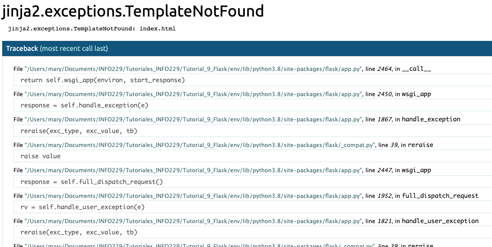

# Tutorial Flask

Flask es un micro-framework de python que nos permite crear aplicaciones web más fácilmente. En este tutorial usaremos Flask para crear una aplicación web simple.

## Entorno de Programación

Para crear esta aplicación, primero tenemos que configurar nuestro entorno de programación, se recomienda trabajar en un entorno virtual de python para evitar que las librerías de cada aplicación puedan entrar en conflicto.
Primero, creamos el directorio donde tendremos nuestra app y nos ubicamos en él en la consola. Una vez dentro, inicializaremos nuestro entorno con el siguiente comando:

    $virtualenv env

Esto crea nuestro entorno, pero debemos decirle al sistema que queremos hacer uso de este, para esto debemos activar nuestro entorno con el comando:

    $source env/bin/activate

Con nuestro entorno activo, instalaremos flask ejecutando el comando

    $pip install flask

y con el comando 'pip freeze' podemos ver las dependencias de nuestra app.

## Aplicación Básica

En nuestro entorno crearemos un archivo hello.py, este servirá de ejemplo de cómo gestionar solicitudes HTTP. Dentro de hello.py tendremos el siguiente código:

    from flask import Flask

    app = Flask(__name__)

    @app.route('/')
    def hello():
        return 'Hello, World!'

En este bloque de código primero estamos importando el objeto Flask desde flask, luego lo usamos para crear la instancia de la aplicación con el nombre app. Le pasamos la variable especial __name__ que alberga el nombre del módulo Python actual. Se utiliza para indicar a la instancia dónde está ubicada, esto se tiene que hacer, porque Flask configura algunas rutas en segundo plano.

Una vez se crea la instancia app, se utiliza para gestionar las solicitudes web entrantes y enviar una respuesta al usuario. El decorador @app.route convierte una función Python en una función vista de Flask que convierte el valor de retorno en una respuesta HTTP que se mostrará a través de un cliente HTTP, como un navegador web. Al pasarle el valor '/' a @app.route, indicamos que esta función responderá a las solicitudes web para la URL '/', que es la URL principal.

La función de vista hello() va a devolver 'Hello, World!' como respuesta.

Para la ejecución de la aplicación, primero indicamos a Flask dónde se encuentra esta con la variable de entorno FLASK_APP

    $export FLASK_APP=hello

Luego la ejecutamos en modo de desarrollo con la variable FLASK_ENV

    $export FLASK_ENV=development

Por último, se ejecuta la applicación con el comando 'flask run', una vez hacemos esto veremos algo así:

    Output:
      * Serving Flask app "hello" (lazy loading)
      * Environment: development
      * Debug mode: on
      * Running on http://127.0.0.1:5000/ (Press CTRL+C to quit)
      * Restarting with stat
      * Debugger is active!
      * Debugger PIN: 326-361-464

La información que nos entrega este output es:
- El nombre de la aplicación.
- El entorno en el que se ejecuta.
- Debug mode nos indica si se está ejecutando el depurador, lo que es útil durante el desarrollo.
- La URL donde se está ejecutando la app.

Si ingresamos la dirección indicada en el navegador, veremos en la pantalla 'Hello, World!'

## Plantillas HTML

Ahora incorporaremos archivos HTML a nuestra app. Flask proporciona la función de ayuda render_template() que permite el uso del motor de plantillas Jinja. Esto hace que gestionar HTML sea más fácil escribiendo el código HTML en archivos .html. Usaremos estas plantillas para crear todas las páginas de la aplicación.

Primero, crearemos esta app en un nuevo archivo llamado app.py, el que contendrá todo el código que se usará para crear nuestro blog.

Importaremos Flask y la función render_template. El archivo tendrá una única función de vista que gestionará las solicitudes a la ruta principal '/'.

    from flask import Flask, render_template

    app = Flask(__name__)

    @app.route('/')
    def index():
      return render_template('index.html')

La función de vista index() devuelve el resultado de llamar a render_template() con index.html como argumento, lo que hace que render_template busque un archivo llamado index.html en la carpeta templates. Como esta carpeta aún no existe, recibiríamos un error si ejecutásemos la app que se ve como a continuación

Por lo tanto, crearemos un directorio templates dentro de nuestro directorio original y dentro de él un archivo index.html con el siguiente código:

    <!DOCTYPE html>
    <html lang="en">
    <head>
        <meta charset="UTF-8">
        <title>FlaskBlog</title>
    </head>
    <body>
       <h1>Welcome to FlaskBlog</h1>
    </body>
    </html>

Guardamos el archivo y si revisamos en el navegador nuevamente, ahora nos dirá 'Welcome to FlaskBlog'.

Además de la carpeta templates, las aplicaciones web Flask también cuentan con una carpeta estática para guardar archivos, como archivos css, JavaScript e imágenes que utilice la app.

Añadiremos, una hoja de estilo llamada style.css, pero primero crearemos el directorio static/css dentro de nuestro directorio principal. La hoja de estilo va dentro de nuestro nuevo directorio static/css y tendrá el siguiente código:

    h1 {
        border: 2px #eee solid;
        color: brown;
        text-align: center;
        padding: 10px;
    }

Esto añadirá un borde, cambiará el color a café, centrará el texto y añadirá un relleno a las etiquetas <h1>.
    
Ahora abriremos el archivo index.html y agregaremos un enlace al archivo style.css dentro de la sección <head>:

    . . .
    <head>
        <meta charset="UTF-8">
        <link rel="stylesheet" href="{{ url_for('static', filename= 'css/style.css') }}">
        <title>FlaskBlog</title>
    </head>
    . . .

Aquí utilizamos la función url_for() para generar la ubicación apropiada del archivo, el primer argumente indica que está vinculado a un archivo estático y el segundo es la ruta del archivo dentro del directorio estático.

Al actualizar la página veremos los cambios aplicados.

Al crear más páginas HTML, podemos evitar la repetición del código creando un archivo de plantilla base, desde el cual heredarán todos los archivos HTML.

Para hacer esto, creamos un archivo base.html dentro de templates con el siguiente código:

    <!doctype html>
    <html lang="en">
    <head>
    <!-- Required meta tags -->
    <meta charset="utf-8">
    <meta name="viewport" content="width=device-width, initial-scale=1, shrink-to-fit=no">

    <!-- Bootstrap CSS -->
    <link rel="stylesheet" href="https://stackpath.bootstrapcdn.com/bootstrap/4.3.1/css/bootstrap.min.css" integrity="sha384-ggOyR0iXCbMQv3Xipma34MD+dH/1fQ784/j6cY/iJTQUOhcWr7x9JvoRxT2MZw1T" crossorigin="anonymous">

    <title> </title>
    </head>
    <body>
    <nav class="navbar navbar-expand-md navbar-light bg-light">
        <a class="navbar-brand" href="{{ url_for('index')}}">FlaskBlog</a>
        <button class="navbar-toggler" type="button" data-toggle="collapse" data-target="#navbarNav" aria-controls="navbarNav" aria-expanded="false" aria-label="Toggle navigation">
            
        </button>
        

            <ul class="navbar-nav">
            <li class="nav-item active">
                <a class="nav-link" href="#">About</a>
            </li>
            </ul>
        

    </nav>
    

         
    

    <!-- Optional JavaScript -->
    <!-- jQuery first, then Popper.js, then Bootstrap JS -->
    
    
    
    </body>
    </html>

la mayor parte de este código es HTML estándar, además del código necesario para Bootstrap. Sin embargo, las siguientes partes son específicas para el funcionamiento del motor de plantillas Jinja:
-  : Sirve como marcador de posición para un título.
- {{ url_for('index')}: Invocación de función que devuelvela URL para la función de vista 'index'.
-  : Se sustituye por contenido que depende de la plantilla secundaria.

Aprovechemos esta plantilla base utilizando herencia. Abrámos el archivo index.html y cambiemos el código por lo siguiente:

    

    
      <h1> Welcome to FlaskBlog </h1>
    

En esta versión, usamos la etiqueta  para indicar que hereda de la plantilla base.html. Las siguientes líneas indican el contenido que se debe sustituir en la plantilla base.

La herencia de plantillas nos ofrece la capacidad de poder reutilizar código de otras plantillas sin tener que repetirlo cada vez.

Si actualizamos la página del navegador, verémos que cambió de estilo.

## Configurar la Base de Datos

Usaremos un archivo SQLite para guardar los datos de entrada, porque en Python tenemos disponible el módulo sqlite3 para interactuar con nuestra base de datos.
Primero ya que nuestros datos serán principalmente entradas de blog, tendremos que crear una tabla 'posts' con las columnas necesarias.

Abramos un archivo llamado schema.sql dentro de nuestro directorio principal de la app y escribamos los siguientes comandos:

    DROP TABLE IF EXISTS posts;

    CREATE TABLE posts (
        id INTEGER PRIMARY KEY AUTOINCREMENT,
        created TIMESTAMP NOT NULL DEFAULT CURRENT_TIMESTAMP,
        title TEXT NOT NULL,
        content TEXT NOT NULL
    );

La tabla posts tiene 4 columnas, id, created(hora de creación del post), title y content.

Ahora que tenemos el esquema, crearemos la base de datos usando un archivo python que a su vez generará un archivo .db de SQLite. Para esto, abriremos un archivo llamado init_db.py dentro del directorio principal de la app y añadiremos el siguiente código:

    import sqlite3

    connection = sqlite3.connect('database.db')

    with open('schema.sql') as f:
        connection.executescript(f.read())

    cur = connection.cursor()

    cur.execute("INSERT INTO posts (title, content) VALUES (?, ?)",
                ('First Post', 'Content for the first post')
                )

    cur.execute("INSERT INTO posts (title, content) VALUES (?, ?)",
                ('Second Post', 'Content for the second post')
                )

    connection.commit()
    connection.close()

Importamos el módulo sqlite3 y abrimos una conexión con el archivo de la base de datos ('database.db'). Luego usamos la función open() para abrir el archivo 'schema.sql'. Después se ejecuta el contenido de este utilizando la función executescript(), lo que crea la tabla posts. Se crea un objeto Cursor, que permite usar el método execute() para ejecutar dos instrucciones SQL INSERT para insertar dos entradas de blog en la tabla.

Ahora ejecutamos el script usando

    $python init_db.py

Ahora tenemos un nuevo archivo database.db en nuestro directorio.

## Mostrar todas las entradas

Después de configurar la base de datos, podemos modificar la función de vista index() para mostrar las entradas que existen en la base de datos.

Para esto, en el archivo app.py realizamos las siguientes modificaciones:

- Importamos sqlite3 en la parte superior del script.

    import sqlite3
    from flask import Flask, render_template

    . . .

- Creamos una función que cree una conexión con la base de datos y que la retorne.

    . . .
    from flask import Flask, render_template

    def get_db_connection():
        conn = sqlite3.connect('database.db')
        conn.row_factory = sqlite3.Row
        return conn

    . . .

Esta función abre una conexión con el archivo database.db, y luego establece el atributo row_factory a sqlite3.Row, lo que significa que la conexión devuelve las filas que se comportan como diccionarios Python regulares. Por último, la función retorna el objeto de conexión conn, que se usará para acceder a la base de datos.

- Ahora modificamos la función index():

    . . .

    @app.route('/')
    def index():
        conn = get_db_connection()
        posts = conn.execute('SELECT * FROM posts').fetchall()
        conn.close()
        return render_template('index.html', posts=posts)

En esta nueva versión, primero se abre una conexión con la base de datos usando la función get_db_connection(). Luego se ejecuta una consulta SQL para seleccionar todas las entradas de la tabla posts. Se implementa el método fetchall() para recuperar las filas del resultado de la consulta. Esto devuelve una lista de las entradas que insertamos en la DB en el paso anterior. A continuación, cerramos la conexión con la base de datos y finalmente, retorna el resultado de representar la plantilla index.html con el objeto posts como argumento, el que contiene los resultados de la DB.

Ahora que se pasan las entradas recuperadas a la plantilla, podemos usar un bucle for para mostrar cada entrada en la página.

Abrimos el archivo index.html y lo modificamos de la siguiente forma:

    

    
        <h1> Welcome to FlaskBlog </h1>
        
            <a href="#">
                <h2>{{ post['title'] }}</h2>
            </a>
            {{ post['created'] }}
            

        
    

La sintaxis  es un bucle for de Jinja, es similar al de Python con la excepción de que este debe ser cerrado con . Con esto hacemos un bucle sobre cada elemento de la lista posts que se pasó con la función index() anteriormente. Dentro del bucle se muestra el título en un encabezado <h2> dentro de una etiqueta <a>, que usaremos más tarde.

Ahora podemos recargar la página del navegador para visualizar los resultados.

## Mostrar una Entrada Única

Crearemos una nueva ruta Flask con una función vista y una nueva plantilla HTML para mostrar una entrada individual por su ID.

Abramos app.py para modificarlo, importaremos la función abort() desde la biblioteca Wekzeug con el fin de responder con una página 404 cuando no se encuentre la entrada.

    import sqlite3
    from flask import Flask, render_template
    from werkzeug.exceptions import abort

    . . .

A continuación, añadimos la función get_post() justo después de la función get_db_connection().

    . . .

    def get_db_connection():
        conn = sqlite3.connect('database.db')
        conn.row_factory = sqlite3.Row
        return conn

    def get_post(post_id):
        conn = get_db_connection()
        post = conn.execute('SELECT * FROM posts WHERE id = ?',
                            (post_id,)).fetchone()
        conn.close()
        if post is None:
            abort(404)
        return post

    . . .

Esta nueva función tiene el argumento post_id que determina que entrada del blog recuperar. Dentro de la función usamos get_db_connection() para abrir una conexión de base de datos y ejecutar una consulta SQL para obtener la entrada asociada a post_id. Se añade el método fetchone() para obtener el resultado y almacenarlo en la variable post. Se cierra la conexión y, si post tiene el valor None, se utiliza la función abort() para responder con el código de error 404, por otro lado, si post tiene un valor distinto de None, la función retorna este valor.

Luego se añade la función de vista al final del archivo app.py

    . . .

    @app.route('/<int:post_id>')
    def post(post_id):
        post = get_post(post_id)
        return render_template('post.html', post=post)

En esta nueva función de vista, se añade una regla de variable <int:post_id> para especificar que luego de '/' viene un entero positivo. Flask reconoce esto y pasa su valor al argumento post_id de su función vista post(). Luego utiliza la función get_post() para obtener la entrada asociada al ID indicado y almacenar el resultado en la variable post, que después pasa por una plantilla post.html que crearemos a continuación.

Abrimos un nuevo archivo de plantilla llamado post.html y escribimos el siguiente código:

    

    
        <h2> {{ post['title'] }} </h2>
        {{ post['created'] }}
        
{{ post['content'] }}

    

A diferencia del index.html, este solo mostrará una entrada.

Ahora podemos navegar a las siguiente URL para visualizar por separado las entradas de la base de datos y una tercera para ver qué sucede cuando no existe una entrada.

    http://127.0.0.1:5000/1
    http://127.0.0.1:5000/2
    http://127.0.0.1:5000/3

Volveremos a editar index.html para asociar cada enlace al título de la entrada con su página respectiva.

    
        <a href="{{ url_for('post', post_id=post['id']) }}">
            <h2>{{ post['title'] }}</h2>
        </a>
        {{ post['created'] }}
        

    

Estamos pasando 'post' a la función url_for() como primer argumento. Este es el nombre de la función de vista post() y le da el valor post['id'] al argumento post_id. La función url_for() devolverá la URL adecuada para cada entrada según el ID.

## Modificar Entradas

###Crear Nueva Entrada

Abramos el archivo app.py para editarlo. Primero, importaremos lo siguiente desde flask:
- El objeto global 'request', para acceder a los datos de solicitud entrantes que se enviarán a través de un formato HTML.
- La función url_for() para generar URLs.
- La función flash() para mostrar un mensaje cuando se procesa una solicitud.
- La función redirect() para redirigir al cliente a una ubicación diferente.

Estas importaciones las añadimos de la siguiente forma:

    import sqlite3
    from flask import Flask, render_template, request, url_for, flash, redirect
    from werkzeug.exceptions import abort

    . . .

La función flash() almacena los mensajes mostrados en la sesión del navegador del cliente, lo que requiere configurar una clave secreta. Esta clave se usa para proteger las sesiones, lo que permite a Flask recordar la información de una solicitud a la otra, como el pasar desde la página de la entrada a la página de índice.

Para establecer una clave secreta, añadiremosuna configuración SECRET_KEY a la aplicación a través del objeto app.config. Lo agregamos en app.py de la siguiente forma:

    . . .
    app = Flask(__name__)
    app.config['SECRET_KEY'] = 'your secret key'

    @app.route('/')
    def index():
        conn = get_db_connection()
        posts = conn.execute('SELECT * FROM posts').fetchall()
        conn.close()
        return render_template('index.html', posts=posts)

    . . .

Recordar que esta clave debería ser un string aleatorio largo.

Tras establecer nuestra clave, crearemos una función de vista que mostrará una plantilla con un formulario que se puede completar para crear una nueva entrada en el blog. Añadimos el siguiente código al final del archivo:

    . . .

    @app.route('/create', methods=('GET', 'POST'))
    def create():
        return render_template('create.html')

Esto crea una ruta '/create' que acepta solicitudes GET y POST. Se pasará una tupla con los tipos de solicitudes aceptadas al argumento methods del decorador @app.route().

Para la plantilla, abrimos un nuevo archivo llamado create.html en el directorio templates, que contendrá lo siguiente:

    

    
    <h1> Create a New Post </h1>

    <form method="post">
        

            <label for="title">Title</label>
            <input type="text" name="title"
                   placeholder="Post title" class="form-control"
                   value="{{ request.form['title'] }}"></input>
        

        

            <label for="content">Content</label>
            <textarea name="content" placeholder="Post content"
                      class="form-control">{{ request.form['content'] }}</textarea>
        

        

            <button type="submit" class="btn btn-primary">Submit</button>
        

    </form>
    

Esta plantilla mostrará un cuadro de entrada de texto para el título, un área de texto para el contenido y un botón para enviar el formulario.

El título de la entrada tiene el valor {{ request.form['title'] }} y el área de texto {{ request.form['content'] }}. Esto es para que los datos no se pierdan en caso de que algo salga mal. Para ver el resultado de nuestros cambios tenemos que ir a http://127.0.0.1:5000/create.

Este formulario envía una solicitud POST a la función de vista create(), pero todavía no tenemos ningún código en la función para gestionar una solicitud POST. Arreglaremos esto de inmediato.

La gestión de la solicitud POST entrante, se hace dentro de la función de vista create(). Se puede gestionar por separado la solicitud POST comprobando el valor de request.method. Cuando su valor es 'POST', entonces tenemos una solicitud de este tipo, los datos enviados serán extraídos, validados y se insertarán en la base de datos.

Modifiquemos la función vista create() en app.py:

    . . .

    @app.route('/create', methods=('GET', 'POST'))
    def create():
        if request.method == 'POST':
            title = request.form['title']
            content = request.form['content']

            if not title:
                flash('Title is required!')
            else:
                conn = get_db_connection()
                conn.execute('INSERT INTO posts (title, content) VALUES (?, ?)',
                             (title, content))
                conn.commit()
                conn.close()
                return redirect(url_for('index'))

        return render_template('create.html')

Cuando nuestra solicitud es POST, se extrae el título y el contenido desde el objeto request.form que le proporciona acceso a los datos del formulario de la solicitud. Si no hay título entonces se mostrará un mensaje al usuario informando que el título es obligatorio. Si el título existe, entonces se abrirá una conexión con la función get_db_connection() y se insertará el título y contenido en la tabla posts.

Tras añadir la entrada del blog a la base de datos, se redirige al cliente a la página index con redirect() pasándole la URL generada con url_for('index').

Ahora podemos ser capaces de agregar una nueva entrada en la base de datos a través de http://127.0.0.1:5000/create

Por último añadiremos un enlace a la barra de navegación en la plantilla base.html, para que sea más fácil acceder a esta página.

Editamos el archivo agregando una nueva etiqueta <li> tras el enlace About dentro de la etiqueta <nav>. A continuación, añadimos un nuevo bloque for sobre el bloque content para mostrar los mensajes generados bajo la barra de navegación. Estos mensajes están disponibles en la función especial get_flashed_message() que ofrece Flask:

    <nav class="navbar navbar-expand-md navbar-light bg-light">
    <a class="navbar-brand" href="{{ url_for('index')}}">FlaskBlog</a>
    <button class="navbar-toggler" type="button" data-toggle="collapse" data-target="#navbarNav" aria-controls="navbarNav" aria-expanded="false" aria-label="Toggle navigation">
        
    </button>
    

        <ul class="navbar-nav">
        <li class="nav-item">
            <a class="nav-link" href="#">About</a>
        </li>
        <li class="nav-item">
            <a class="nav-link" href="{{url_for('create')}}">New Post</a>
        </li>
        </ul>
    

    </nav>
    

    
        
{{ message }}

    
     
    

Ahora la barra de navegación tendrá un elemento New Post que enlaza a la ruta /create.

### Editar una Entrada

Para que el blog se mantenga actualizado, debe ser posible editar las entradas existentes, para esto añadiremos una nueva ruta al archivo app.py. Su función de vista recibirá el ID de la entrada a ser editada, la URL estará en el formato /post_id/edit con post_id siendo el ID de la entrada.

Vamos a añadir la función de vista edit() al final del archivo, está será bastante similar a la función create().

    . . .

    @app.route('/<int:id>/edit', methods=('GET', 'POST'))
    def edit(id):
        post = get_post(id)

        if request.method == 'POST':
            title = request.form['title']
            content = request.form['content']

            if not title:
                flash('Title is required!')
            else:
                conn = get_db_connection()
                conn.execute('UPDATE posts SET title = ?, content = ?'
                             ' WHERE id = ?',
                             (title, content, id))
                conn.commit()
                conn.close()
                return redirect(url_for('index'))

        return render_template('edit.html', post=post)

La entrada que se edita viene determinada por la URL y Flask pasará el ID a la función edit() mediante el argumento 'id'. Este valor se añade a la función get_post() para recuperar la entrada asociada.

Al igual que en create(), primero se extraen los datos del objeto request.form, abre una conexión con la base de datos y actualiza la tabla con los nuevos datos.

En el caso de una solicitud 'GET', representa una plantilla edit.html pasando el valor de post que corresponde al valor retornado por get_post. Esto se usará para mostrar el título existente y el contenido en la página de edición.

Vamos a crear una nueva plantilla edit.HTML con el siguiente código:

    

    
    <h1> Edit "{{ post['title'] }}" </h1>

    <form method="post">
        

            <label for="title">Title</label>
            <input type="text" name="title" placeholder="Post title"
                   class="form-control"
                   value="{{ request.form['title'] or post['title'] }}">
            </input>
        

        

            <label for="content">Content</label>
            <textarea name="content" placeholder="Post content"
                      class="form-control">{{ request.form['content'] or post['content'] }}</textarea>
        

        

            <button type="submit" class="btn btn-primary">Submit</button>
        

    </form>
    

    

Este código sigue el mismo patrón excepto por {{ request.form['title'] or post['title'] }} y {{ request.form['content'] or post['content'] }}. Esto muestra los datos guardados en la solicitud si existe, si no, muestra los datos de la variable post que se pasó a la plantilla y quie contiene los datos actuales de la base de datos.

Para editar la primera entrada navegamos a http://127.0.0.1:5000/1/edit

Ahora necesitamos añadir un enlace que apunte a la página de edición para cada entrada en index.

Abrimos index.html y lo modificamos de la siguiente forma:

    

    
        <h1> Welcome to FlaskBlog </h1>
        
            <a href="{{ url_for('post', post_id=post['id']) }}">
                <h2>{{ post['title'] }}</h2>
            </a>
            {{ post['created'] }}
            <a href="{{ url_for('edit', id=post['id']) }}">
                Edit
            </a>
            

        
    

Aquí añadimos una etiqueta <a> para enlazar a la función de vista edit(), pasando el valor post['id'] al enlace para editar la página de cada entrada con el enlace Edit.

### Eliminar una Entrada

Primero vamos a añadir una nueva ruta /ID/delete que acepta solicitudes POST de forma similar a edit(). La nueva función de vista delete() recibirá el ID de la entrada que será eliminada de la URL.

En el archivo app.py añadimos el siguiente código al final:

    ....

    @app.route('/<int:id>/delete', methods=('POST',))
    def delete(id):
        post = get_post(id)
        conn = get_db_connection()
        conn.execute('DELETE FROM posts WHERE id = ?', (id,))
        conn.commit()
        conn.close()
        flash('"{}" was successfully deleted!'.format(post['title']))
        return redirect(url_for('index'))

Esta función de vista solo acepta solicitudes POST, esto significa que navegar a la ruta /ID/delete devolverá un error, porque los navegadores van de forma predeterminada a las solicitudes GET.

Sin embargo, podemos acceder a esta ruta mediante un formulario que envía una solicitud POST pasando el ID de la entrada que se desea eliminar. La función recibirá el ID y lo usará para obtener la entrada de la base de datos con la función get_post(). Luego, abrirá una conexión a la base de datos y ejecutará un comando SQL para eliminar la entrada, confirma el cambio en la DB y cierra la conexión mientras le muestra al usuario un mensaje que informa que la entrada se eliminó correctamente y lo redirige a la página de inicio.

Ahora abriremos el archivo edit.html y añadiremos la etiqueta <form> tras la etiqueta 
 y directamente antes de la línea :

    

    <form action="{{ url_for('delete', id=post['id']) }}" method="POST">
        <input type="submit" value="Delete Post"
                class="btn btn-danger btn-sm"
                onclick="return confirm('Are you sure you want to delete this post?')">
    </form>

    

Esto utiliza el método confirm() para mostrar un mensaje de confirmación antes de enviar la solicitud.

Ahora podemos navegar a http://127.0.0.1:5000/1/edit e intentar eliminar la entrada.

Con todo esto, el usuario ahora puede agregar, editar y eliminar entradas del blog.
